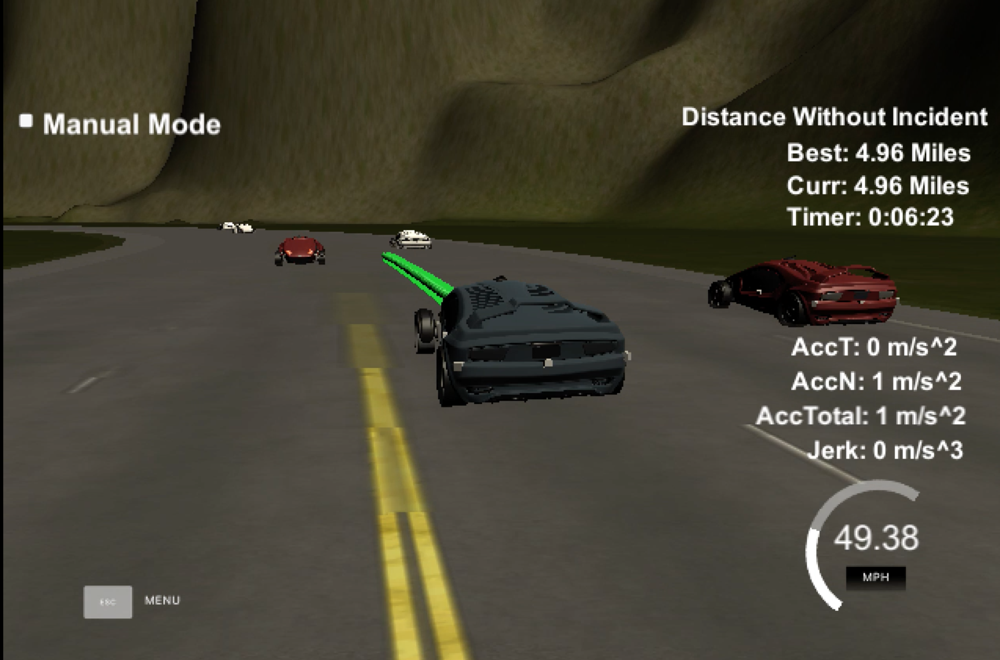

# CarND-Path-Planning-Project
### Goals
In this project your goal is to safely navigate around a virtual highway with other traffic that is driving +-10 MPH of the 50 MPH speed limit. The simulator provides the car's localization and sensor fusion data as well as a sparse map list of waypoints around the highway. The car should drive at max safe speed (without exceeding 50 mph speed limit) without collision or exceeding total acceleration over 10 m/s^2 and jerk that is greater than 50 m/s^3.

### Model Description
The path planner algorithm is implemented as follows:
In each update cycle:
1. Save localisation data (x,y,s,d, yaw,speed), sensor fusion data about other cars  and also the previous path (if any) received from the simulator
2. Find the optimal lane and closest gap within that lane (gap can be positive or negative)
The optimal lane function uses a cost function that finds the closest vehicle for each lane and then assigns a cost (0 or 1E12) to each lane based on whether the closest vehicle is within a safe interval (gap > SAFE_REAR_GAP && gap < SAFE_FRONT_GAP). The cost function priritises staying in the lane and also leaves more buffer in the front as compared to the rear gap when deciding if it is too close.
3. Decide on the basis of the optimal lane and gap whether to:
- change lane
- keep lane
- speed up or down (adjust the ref_vel)
4. The optimal lane is then used to build up a path using anchor points from the previous path plus new points using a spline to project a smooth path. The spline technique uses anchor points that project 30,60,90 meters ahead of the current car position along the highway waypoints (s position) and the optimal lane centre line (d position). this technique is detailed in the project briefing video and worked well to ensure smooth lane traversal/changes without exceeding jerk or acceleration limits. Jerk Minimimising Trajectories (JMT) is an alterative approach which I started on but droppted in favour of the more elegant or should I say less coding spline based approach.

### Reflections



THe car drove around the loop without incident in about 5 mins (see image). On one runs there was collision when on of the other vehicles suddenly changed lanes (probabaly bad behaviour from other others). This may require more aggressive braking as compared to the gradual slowdown although this would be sure to exceed jerk parameters.Lastly, I definitely want to finish the JMT approach to see how it compares to the spline technique.

## Basic Build Instructions

1. Clone this repo.
2. Make a build directory: `mkdir build && cd build`
3. Compile: `cmake .. && make`
4. Run it: `./path_planning`.

Here is the data provided from the Simulator to the C++ Program

#### Main car's localization Data (No Noise)

["x"] The car's x position in map coordinates

["y"] The car's y position in map coordinates

["s"] The car's s position in frenet coordinates

["d"] The car's d position in frenet coordinates

["yaw"] The car's yaw angle in the map

["speed"] The car's speed in MPH

#### Previous path data given to the Planner

//Note: Return the previous list but with processed points removed, can be a nice tool to show how far along
the path has processed since last time. 

["previous_path_x"] The previous list of x points previously given to the simulator

["previous_path_y"] The previous list of y points previously given to the simulator

#### Previous path's end s and d values 

["end_path_s"] The previous list's last point's frenet s value

["end_path_d"] The previous list's last point's frenet d value

#### Sensor Fusion Data, a list of all other car's attributes on the same side of the road. (No Noise)

["sensor_fusion"] A 2d vector of cars and then that car's [car's unique ID, car's x position in map coordinates, car's y position in map coordinates, car's x velocity in m/s, car's y velocity in m/s, car's s position in frenet coordinates, car's d position in frenet coordinates. 

## Details

1. The car uses a perfect controller and will visit every (x,y) point it recieves in the list every .02 seconds. The units for the (x,y) points are in meters and the spacing of the points determines the speed of the car. The vector going from a point to the next point in the list dictates the angle of the car. Acceleration both in the tangential and normal directions is measured along with the jerk, the rate of change of total Acceleration. The (x,y) point paths that the planner recieves should not have a total acceleration that goes over 10 m/s^2, also the jerk should not go over 50 m/s^3. (NOTE: As this is BETA, these requirements might change. Also currently jerk is over a .02 second interval, it would probably be better to average total acceleration over 1 second and measure jerk from that.

2. There will be some latency between the simulator running and the path planner returning a path, with optimized code usually its not very long maybe just 1-3 time steps. During this delay the simulator will continue using points that it was last given, because of this its a good idea to store the last points you have used so you can have a smooth transition. previous_path_x, and previous_path_y can be helpful for this transition since they show the last points given to the simulator controller with the processed points already removed. You would either return a path that extends this previous path or make sure to create a new path that has a smooth transition with this last path.

## Tips

A really helpful resource for doing this project and creating smooth trajectories was using http://kluge.in-chemnitz.de/opensource/spline/, the spline function is in a single hearder file is really easy to use.

---

## Dependencies

* cmake >= 3.5
 * All OSes: [click here for installation instructions](https://cmake.org/install/)
* make >= 4.1
  * Linux: make is installed by default on most Linux distros
  * Mac: [install Xcode command line tools to get make](https://developer.apple.com/xcode/features/)
  * Windows: [Click here for installation instructions](http://gnuwin32.sourceforge.net/packages/make.htm)
* gcc/g++ >= 5.4
  * Linux: gcc / g++ is installed by default on most Linux distros
  * Mac: same deal as make - [install Xcode command line tools]((https://developer.apple.com/xcode/features/)
  * Windows: recommend using [MinGW](http://www.mingw.org/)
* [uWebSockets](https://github.com/uWebSockets/uWebSockets)
  * Run either `install-mac.sh` or `install-ubuntu.sh`.
  * If you install from source, checkout to commit `e94b6e1`, i.e.
    ```
    git clone https://github.com/uWebSockets/uWebSockets 
    cd uWebSockets
    git checkout e94b6e1
    ```


